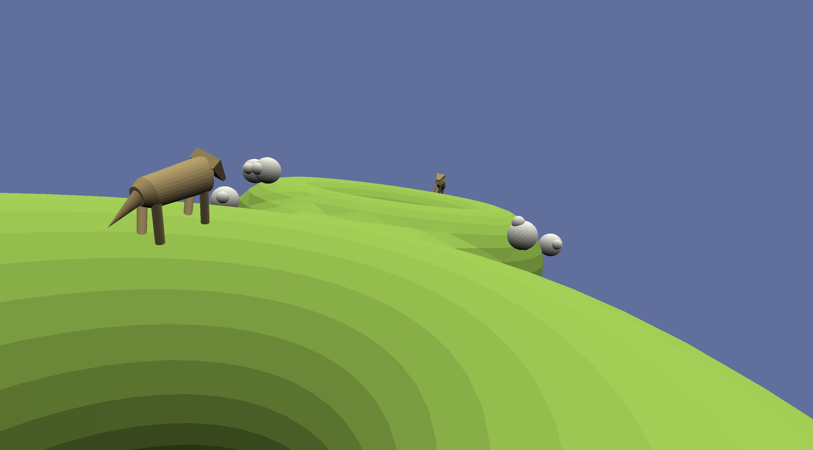

# 3D Herding

Author: Russell Emerine

Design:
I don't know of any games that are specifically
collaborative and played on a complex 3D surface,
so I decided to make one.
It would be interesting to expand the game with levels
of varying shapes.
A single player could do very well on a long, thin strip,
but many players would need to work together
to do well on a wide-open plane.

Networking:
My game is structured similarly to the base code,
where the client sends inputs to the server,
and the server does most of the calculation and
sends the entire game state back to the client.
One interesting separation of roles is that
player camera pitch is handled client-side,
while yaw is handled server-side.
This organization allows the server to store one rotation
that always shows the player characters standing straight
on the surface,
since pitch is not used in any calculations anyway.
This means there theoretically can be cases where yaw lags
but pitch doesn't lag.
I would need to change this organization and also send pitch to the
server if, for example, I wanted to make the player characters' heads
angle to where they're looking.

Screen Shot:

How To Play:
Set up the server using the command `./server <port>`,
and set up a client using `./client <host> <port>`.
Move using WASD and look around using the mouse.
Work together with other players to try to push the sheep as close
together as possible.
You might need a lot of players to do this well!
The closer together the sheep are,
the bluer the sky will be.

Credits:
`WalkMesh` code was partially taken from the game5 base code,
partially written by me and check against implementations
made by Sirui (Ray) Huang, Michael Stroucken, and Nellie Tonev,
as detailed in [`Walkmesh.cpp`](WalkMesh.cpp).

This game was built with [NEST](NEST.md).

